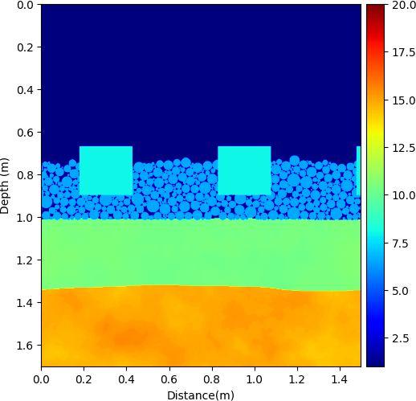
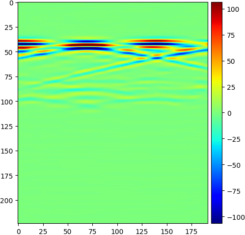
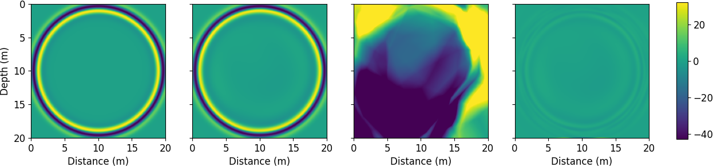
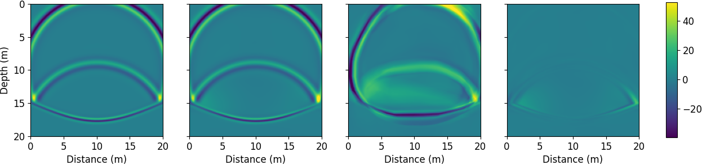
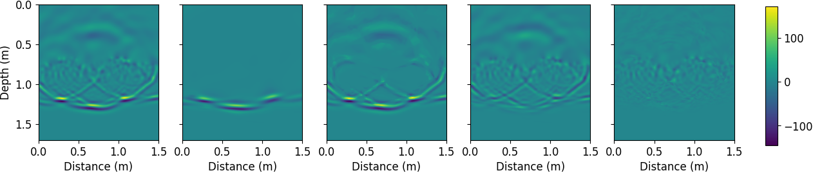
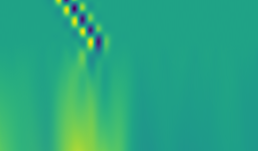

========
PINN4GPR
========

------------------------------------------------------------------------------------------------------------
Railway infrastructure GPR dataset creation and modeling via black box and physics-informed neural networks.
------------------------------------------------------------------------------------------------------------

This project enables you to:

* Generate Ground Penetrating Radar (GPR) datasets of realistic railway track configurations with `gprMax <https://www.gprmax.com/>`_. 
* Train a CNN-based surrogate model for gprMax on the generated data, which at inference time is two orders of magnitude faster than FDTD simulations.
* Use the surrogate model for faster large-scale dataset generation.
* Explore the use of physics-informed neural networks (PINNs) for the approximation of GPR wavefield data in complex railway track geometries.

Refer to the `full documentation <https://pinn4gpr.readthedocs.io/en/latest/index.html>`_ for installation and usage instructions.

An in-depth account of this work is available on my `Master Thesis report <master_thesis_report.pdf>`_.

Dataset generation
==================

A-scan dataset
--------------

.. |geom_ascan| image:: figures/dataset_creation/ascan_dataset/geom.png
    :height: 300
.. |ascan| image:: figures/dataset_creation/ascan_dataset/ascan.png
    :height: 300

============ =======
|geom_ascan| |ascan|  
geometry     ascan
============ =======

B-scan dataset
--------------

.. |geom_bscan| image:: figures/dataset_creation/bscan_dataset/geom.png
    :height: 300
.. |bscan| image:: figures/dataset_creation/bscan_dataset/bscan.png
    :height: 300

============ =======
|geom_bscan| |bscan|
geometry     bscan
============ =======

CNN black box model
===================
An encoder-decoder CNN architecture was used to approximate the B-scan predictions from the sample geometry:

========== =========== ==========
|geom_cnn| |label_cnn| |pred_cnn|  
geometry   label       prediction
========== =========== ==========

PINN models
===========

MLP on uniform geometry
-----------------------

Time domain extension for a uniform geometry:

===========================================================
|uniform_fig|
ground truth, PINN prediction, NN prediction and difference
===========================================================

MLP on two layer geometry
-------------------------

Time domain extension for a two layer geometry:

===========================================================
|2layer_fig|
ground truth, PINN prediction, NN prediction and difference
===========================================================

MLP on railway geometry
-----------------------

============================================================
|mlp_rail_fig|
ground truth, PINN prediction, NN prediction and differences
============================================================

CNN on railway geometry
-----------------------

.. |time2image_gt| image:: figures/time2image/gt.gif
    :width: 400
.. |time2image_pred| image:: figures/time2image/preds.gif
    :width: 400

=============== =================
|time2image_gt| |time2image_pred|  
ground truth    PINN predictions
=============== =================

1D wave propagation
-------------------

distance/time charts:

======== =======  =================
|1D_mlp| |1D_cnn| |1D_discrete_mlp|  
MLP      CNN      discrete MLP
======== ======== =================
