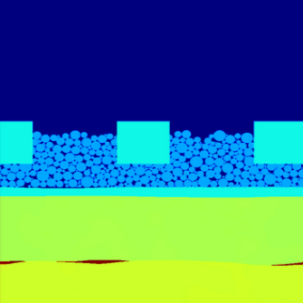
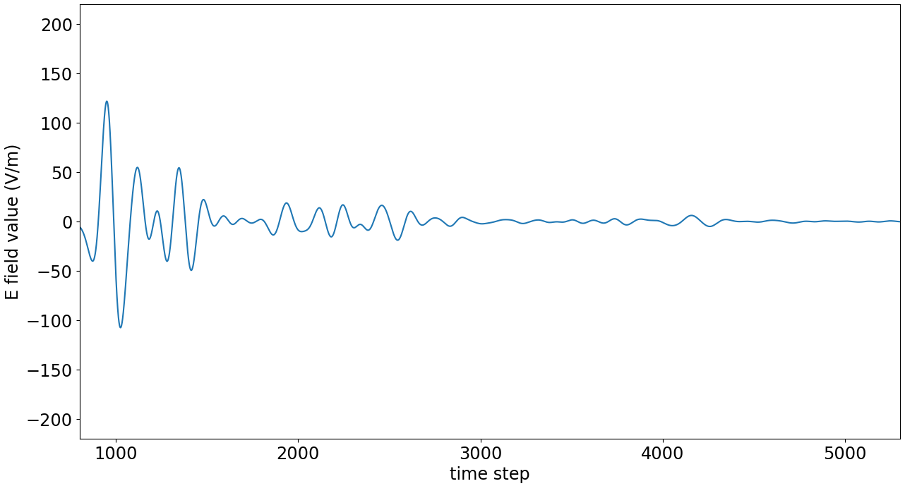
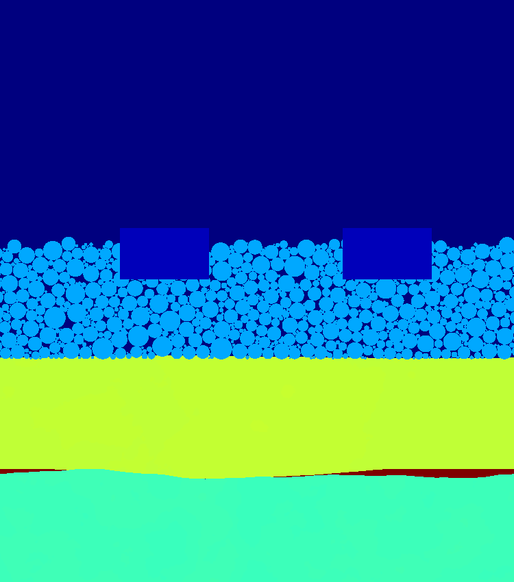
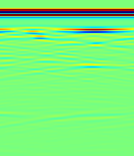

========
PINN4GPR
========

------------------------------------------------------------------------------------------------------------
Railway infrastructure GPR dataset creation and modeling via black box and physics-informed neural networks.
------------------------------------------------------------------------------------------------------------

This project enables you to:

* Generate Ground Penetrating Radar (GPR) datasets of realistic railway track configurations with `gprMax <https://www.gprmax.com/>`_. 
* Train a CNN-based surrogate model for gprMax on the generated data, which at inference time is two orders of magnitude faster than FDTD simulations.
* Use the surrogate model for faster large-scale dataset generation.
* Explore the use of physics-informed neural networks (PINNs) for the approximation of GPR wavefield data in complex railway track geometries.

Refer to the `full documentation <https://pinn4gpr.readthedocs.io/en/latest/index.html>`_ for installation and usage instructions.

Dataset generation
==================

A-scan dataset
--------------

B-scan dataset
--------------

CNN black box model
===================
An encoder-decoder CNN architecture was used to approximate the B-scan predictions from the sample geometry:

PINN models
===========
